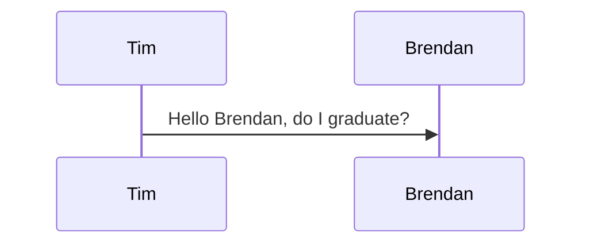

# For-Never Home

## User Stories:
 - As a user, I can create an account, which stores my created entries.
 - I can log out, and login again upon my return.
 - I can view other entries from other users.
 - I can edit and delete my created entries.

## GitHub Repositories:

### Front-end:
https://github.com/timeminker/forneverhome-auth
### Back-end:
https://github.com/timeminker/ForNeverHome_backend

## Heroku Deployments:

### Front-end:
https://forneverhome-auth.herokuapp.com/
### Back-end:
https://forneverhome-backend.herokuapp.com/admin

## Technologies Utilized:

 - Vue.js
 - Vue Router
 - Django
 - PostgreSQL
 - FireBase
 - TypeScript (learned)

## Issues to Address

 - Allow users to upload photos to FireBase or AWS S3 bucket.
 - More social functionality (allow other users to comment on entries they did not create).
 - Create functionality to only allow for certain species entries and specify filters.

## Questions:

